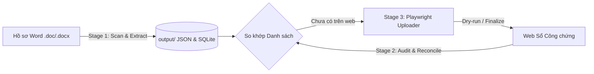

# Upload Lab — System Specification & Architecture

Hệ thống độc lập tự động hóa nghiệp vụ cho Văn phòng Công chứng: Đọc & phân tích hồ sơ Word (`.doc`/`.docx`) $\rightarrow$ Chuẩn hóa & trích xuất dữ liệu form công chứng $\rightarrow$ Đối chiếu sổ công chứng Excel từ web $\rightarrow$ Điền tự động & upload qua Playwright.

---

## 1. Kiến trúc luồng nghiệp vụ (End-to-End Workflow)



### Giai đoạn 1: Quét & Trích xuất (`batch_scan.py` + `extract_contract.py`)
1. **Đọc tệp tin**:
   - `.docx`: Đọc bằng `python-docx`, bảo toàn thứ tự đoạn văn và bảng biểu (`table`) để tránh trộn lẫn Bên A / Bên B.
   - `.doc`: Đọc bằng Windows IFilter (`query.dll`) không cần Microsoft Word.
2. **Phân loại văn bản (`_detect_document_kind_and_title`)**:
   - Phân loại theo tiêu đề/header thành các nhóm: `transfer_contract` (Chuyển nhượng), `asset_commitment` (Cam kết tài sản riêng), `mortgage_contract` (Thế chấp), `inheritance_partition` (Phân chia di sản), `inheritance_refusal` (Từ chối di sản), `generic`.
3. **Bóc tách trường dữ liệu**:
   - Đương sự (`duong_su`, `nguoi_yeu_cau`), Tài sản (`tai_san`, `loai_tai_san`), Số công chứng (`so_cong_chung`), Ngày công chứng, Công chứng viên, Nhóm hợp đồng.
4. **Lưu trữ**:
   - Ghi JSON chi tiết vào thư mục `output/<so_cc>_<hash>.json`.
   - Ghi bản ghi vào `registry.sqlite3` (trạng thái ban đầu: `SCANNED`).
   - Xuất file manifest chạy theo đợt vào `runs/<timestamp>.json`.

### Giai đoạn 2: Đối chiếu & Phân loại hàng đợi (`ui/services/`)
1. **Kiểm toán Sổ Excel (`contract_book_audit.py`)**:
   - Đọc danh sách số công chứng đã có trên web (tải qua Playwright hoặc nạp file Excel có sẵn).
   - Chuẩn hóa số công chứng về định dạng `xxx/yyyy`.
   - Tính toán dải số liên tục (min - max) và phát hiện các **số bị hở (thiếu)** theo từng năm.
2. **Phân loại hàng đợi Upload (`scan_classification_service.py`)**:
   - So khớp danh sách quét từ folder với danh sách Excel trên web:
     - `chua co trong Excel`: Tự động đánh dấu tick cần upload.
     - `da co trong Excel`: Bỏ chọn, tránh upload trùng.
     - `sai format` / `sai nam` / `khong co so`: Cảnh báo để người dùng kiểm tra lại file Word.

### Giai đoạn 3: Tự động hóa Upload (`playwright_uploader.py` + `uploader_selectors.py`)
1. **Đăng nhập thủ công, không lưu mật khẩu**:
   - App **không** lưu tên đăng nhập hoặc mật khẩu. Người dùng tự đăng nhập trong Chromium do app mở.
   - App nhận biết đã đăng nhập khi local storage có `access_token` và trang đã rời `/dang-nhap`.
   - Sau đó lưu lại session vào `nd_storage_state.json` để tái sử dụng.
   - Một Chromium dùng chung cho cả đăng nhập, tải Excel và chuẩn bị upload.
2. **Điền biểu mẫu (Web Form Automation)**:
   - Điều hướng vào trang tạo mới hồ sơ công chứng.
   - Tự động điền: Tên hợp đồng, Số công chứng, Ngày công chứng, Nhóm HĐ (dropdown), Loại tài sản (radio/dropdown), Công chứng viên, Người yêu cầu, Đương sự (Textarea), Tài sản (Textarea).
3. **Chuẩn bị theo đợt & người dùng tự bấm Lưu**:
   - Người dùng chọn số tab mở mỗi đợt (1–30) ngay trên trang *Folder Scan & Upload*; mỗi tab gắn với một `record_id` nên không mở trùng hồ sơ.
   - App điền sẵn rồi **dừng trước nút Lưu** — người dùng kiểm tra trực quan và tự bấm *Lưu*. App không bấm thay.
   - App nhận biết đã Lưu qua phản hồi `POST /api/hoso` thành công (hoặc web chuyển khỏi trang tạo nhanh), tự đóng tab đó, cập nhật `uploaded_success` vào `registry.sqlite3` và bỏ dòng khỏi bảng.
   - Bấm *Tiếp tục N số tiếp theo* để mở đợt mới; app không tự mở đợt kế tiếp.

> [!NOTE]
> Hợp đồng chi tiết của luồng đăng nhập, nhận diện Lưu và kế hoạch kiểm tra môi trường trước lần đăng nhập đầu xem tại: [`docs/handoff-login-handshake.md`](docs/handoff-login-handshake.md) và [`docs/fluent_ui_redesign/SPEC_LAYOUT_FLUENT_UI.md`](docs/fluent_ui_redesign/SPEC_LAYOUT_FLUENT_UI.md).

---

## 2. Quy chuẩn Dữ liệu Web Form (Data Schema)

| Trường Web Form | Quy tắc & Nguồn trích xuất | Ví dụ giá trị |
|---|---|---|
| `ten_hop_dong` | Chuẩn hóa theo loại văn bản quy chuẩn | `Hợp đồng chuyển nhượng quyền sử dụng đất` |
| `so_cong_chung` | Chuẩn hóa rút gọn `xxx/yyyy` (bỏ hậu tố nghiệp vụ) | `428/2026` (từ `428/2026/CCGD`) |
| `ngay_cong_chung` | Ngày lập hợp đồng trong lời chứng hoặc tiêu đề | `15/04/2026` |
| `nhom_hop_dong` | Ánh xạ danh mục dropdown hệ thống web | `Chuyển nhượng - Mua bán`, `Cầm cố - Thế chấp - Vay` |
| `loai_tai_san` | Xác định dựa trên chi tiết tài sản đính kèm đất | `Đất đai có tài sản`, `Đất đai không có tài sản` |
| `cong_chung_vien` | Nhận diện tên CCV ký lời chứng (hoặc mặc định) | `Phạm Minh Chi` |
| `thu_ky` | Cán bộ soạn thảo mặc định | `Nguyễn Nhật Minh` |
| `nguoi_yeu_cau` | Ưu tiên Bên nhận / Bên cam kết / Đại diện NH | `1. Ông Nguyễn Văn B (CCCD: 0360...)` |
| `duong_su` | Bóc tách theo khối Bên A / Bên B hoặc Nhóm người | Gồm Họ tên, Ngày sinh, CCCD/CMND, Địa chỉ cư trú |
| `tai_san` | Đoạn mô tả thửa đất, diện tích, GCN, dừng trước cam đoan | `Quyền sử dụng đất tại xã A... Thửa số 10...` |

> [!NOTE]
> Chi tiết toàn bộ quy tắc regex nhận diện và điểm bắt đầu/kết thúc của từng loại văn bản xem tại: [`docs/regex-rules.md`](docs/regex-rules.md).

---

## 3. Cấu trúc Codebase

```text
upload_lab/
|-- run.bat                         # 1-Click launcher cho người dùng
|-- run_ui.bat                      # Bootstrap shell: kiểm tra Python & gọi bootstrap_ui.py
|-- bootstrap_ui.py                 # Tự tạo .venv, cài dependencies & mở UI
|-- ui_runner.py                    # Entry point khởi chạy PySide6 UI
|-- extract_contract.py             # Trích xuất Word sang JSON web form
|-- batch_scan.py                   # Quét folder, xuất manifest, ghi SQLite
|-- playwright_uploader.py          # Script điều khiển trình duyệt Playwright
|-- uploader_selectors.py           # Selectors định vị phần tử web form
|-- regex_lab.py                    # CLI ingest/review/verify cho vòng lặp đánh giá regex
|-- review_regex_samples.py         # Xuất báo cáo regex (CSV/JSON/XLSX) từ mẫu thực tế
|-- build_standalone_release.ps1    # Script đóng gói bản phát hành độc lập
|-- docs/
|   |-- regex-rules.md              # Catalog quy tắc regex chuẩn cho các loại văn bản
|   |-- handoff-login-handshake.md  # Hợp đồng luồng đăng nhập thủ công & nhận diện Lưu
|   `-- fluent_ui_redesign/         # Spec Fluent UI 2.0 + kế hoạch kiểm tra môi trường
|-- ui_qt/                          # Giao diện Fluent (PySide6-Fluent-Widgets)
|   |-- app.py                      # Khởi tạo QApplication, áp theme
|   |-- main_window.py              # FluentWindow: navigation, các trang, signal/slot
|   |-- theme.py                    # Design token + QSS bổ sung trên nền qdarktheme
|   |-- widgets.py                  # Widget dùng chung
|   `-- workers.py                  # QThread worker cho scan / audit / upload
|-- ui/services/                    # Nghiệp vụ kiểm toán Excel, phân loại scan & upload
|-- tools/inspect_ui_style.py       # Dump metric/màu widget để soi hồi quy giao diện
|-- tests/                          # 109 unit tests bao phủ toàn bộ luồng
`-- regex_review_samples/           # Thư mục chứa sample test và báo cáo đánh giá regex
```

---

## 4. Chuẩn Giao diện (UI Design Standard)

Giao diện là **PySide6 + PySide6-Fluent-Widgets (`qfluentwidgets`)**, dựng hoàn toàn bằng Python trong [`ui_qt/main_window.py`](ui_qt/main_window.py) — không dùng file `.ui` (Qt Designer) nữa.

- **Cửa sổ chính**: kế thừa `FluentWindow`, điều hướng bằng `NavigationItemPosition` thay cho `QTabWidget` ngang kiểu cũ.
- **Widget Fluent**: `CardWidget`/`ElevatedCardWidget` cho khối nội dung, `PrimaryPushButton`/`FluentPushButton` cho nút bấm, `FluentIcon` cho icon, `TitleLabel`/`BodyLabel`/`CaptionLabel` cho chữ.
- **Theme**: `ui_qt/theme.py` set nền `qdarktheme` (light) rồi phủ thêm QSS tùy biến cho KPI card, sidebar, bảng — token khai báo tập trung ở đầu file (`PRIMARY_COLOR`, `CONTROL_MIN_HEIGHT`, `CORNER_RADIUS`, ...).
- **Đặc tả đầy đủ & mockup**: [`docs/fluent_ui_redesign/SPEC_LAYOUT_FLUENT_UI.md`](docs/fluent_ui_redesign/SPEC_LAYOUT_FLUENT_UI.md).
- **Kiểm tra hồi quy giao diện**: `./.venv/Scripts/python.exe ./tools/inspect_ui_style.py` để dump metric/màu thực tế của widget.

> [!IMPORTANT]
> Mọi thay đổi giao diện đi trực tiếp vào `ui_qt/main_window.py` và `ui_qt/theme.py`. Không tạo lại file `.ui` hay tài liệu spec song song khác — tài liệu rời rạc sẽ lệch khỏi code rất nhanh.

---

## 5. Vận hành & Kiểm thử

- **Khởi chạy ứng dụng**:
  ```cmd
  run.bat
  ```
- **Chạy toàn bộ Unit Tests**:
  ```powershell
  .\.venv\Scripts\python.exe -m unittest discover -s tests
  ```
- **Đánh giá Regex với mẫu thực tế**:
  Đặt file Word vào `regex_review_samples/input/` và chạy:
  ```powershell
  .\.venv\Scripts\python.exe .\review_regex_samples.py
  ```
  *(Kết quả được ghi vào `regex_review_samples/reports/` dạng CSV, JSON và XLSX).*
