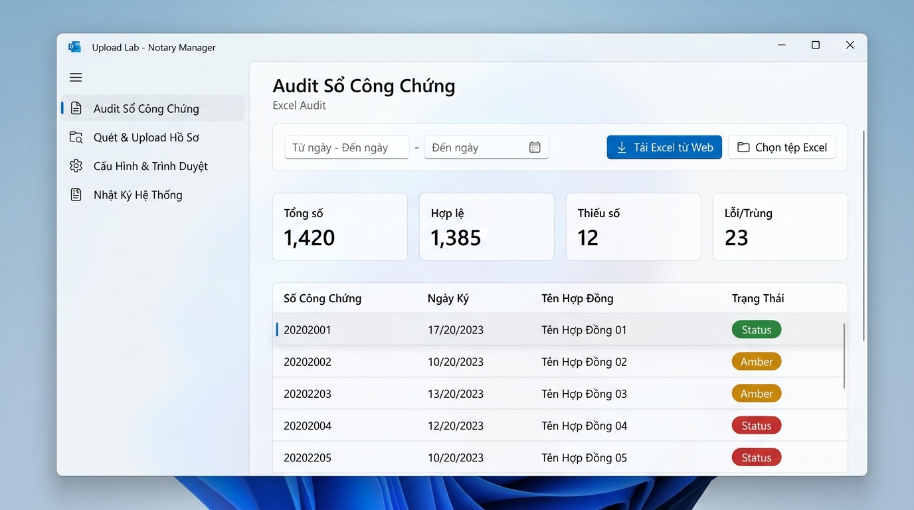
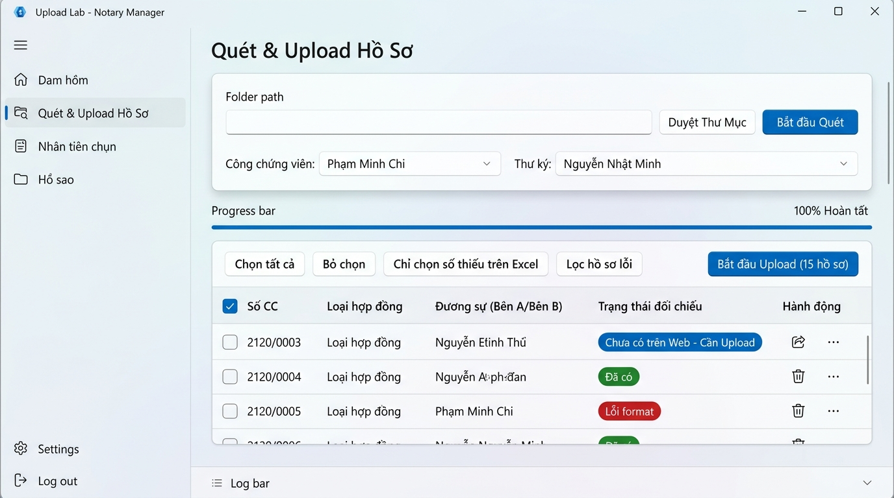
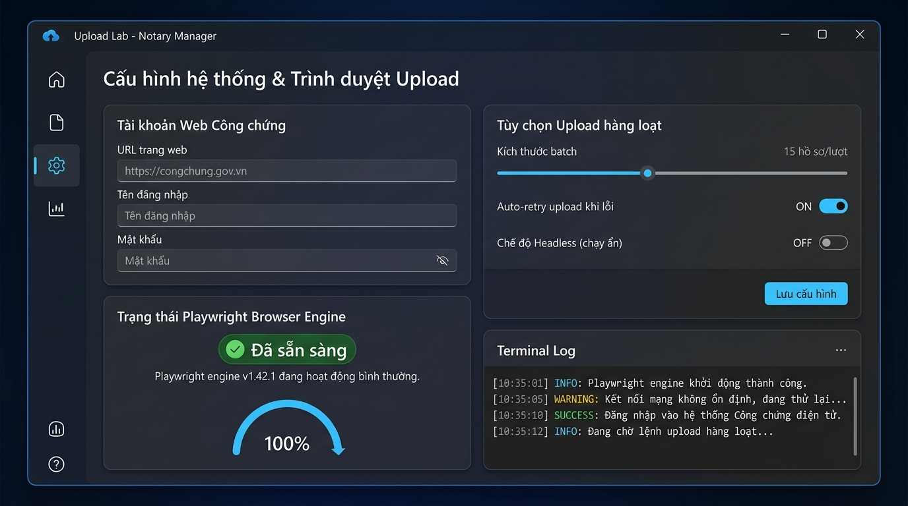
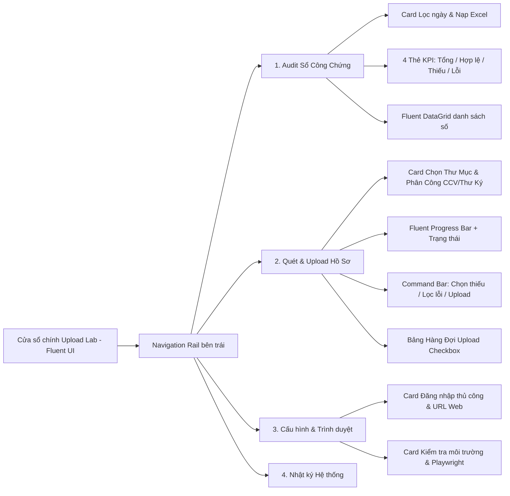

# Upload Lab — Fluent UI Redesign Specification (Windows 11)

Tài liệu đặc tả thiết kế lại toàn diện giao diện (UI/UX) cho ứng dụng desktop **Upload Lab**, áp dụng ngôn ngữ thiết kế **Microsoft Fluent Design System 2.0 (WinUI 3)** chuẩn Windows 11.

---

## 1. So sánh & Khuyến nghị Model: Gemini 3.7 Flash vs Gemini 3.1 Pro

| Tiêu chí | Gemini 3.7 Flash (Thinking / Hybrid Reasoning) | Gemini 3.1 Pro (Deep Heavy Reasoning) |
|---|---|---|
| **Tốc độ phản hồi (Latency & Throughput)** | **Rất nhanh (Real-time iteration)** | Chậm hơn đáng kể (Thời gian chờ lâu) |
| **Khả năng thiết kế UI & Styling (QSS / PySide6)** | **Xuất sắc**, tạo mã giao diện sạch, đúng chuẩn design token | Rất tốt, nhưng có xu hướng viết dài dòng |
| **Quy trình Pair-Programming / Refactoring** | **Tối ưu nhất**: Thử nghiệm, tinh chỉnh layout, sửa lỗi CSS/QSS và chạy test liên tục không ngắt quãng | Phù hợp hơn cho các bài toán phân tích kiến trúc trừu tượng quy mô lớn |
| **Tool Calling & Tương tác tệp tin** | Độ chính xác cao, tự điều chỉnh suy nghĩ (thinking) linh hoạt | Rất chính xác |

> [!TIP]
> **Khuyến nghị chính thức**: Sử dụng **Gemini 3.7 Flash** cho toàn bộ dự án từ đầu. Với khả năng suy luận kết hợp (thinking capability) cùng tốc độ xử lý nhanh, Gemini 3.7 Flash giúp quá trình thiết kế, xuất mã giao diện, preview và tinh chỉnh giao diện diễn ra liền mạch, không bị trễ thời gian chờ đợi.

---

## 2. Hình ảnh Thiết kế Mẫu (Rendered UI Mockups)

Dưới đây là các bản vẽ giao diện mẫu đã được render theo chuẩn Microsoft Fluent UI:

````carousel

<!-- slide -->

<!-- slide -->

````

---

## 3. Đánh giá hiện trạng & Giải pháp khắc phục

```mermaid
graph TD
    subgraph Hiện Trạng (Cũ)
        A1[Thanh Tab ngang kiểu cũ, cứng nhắc]
        A2[Nút bấm to nhỏ lộn xộn, rải rác trên nhiều dòng]
        A3[3 Bảng chèn ép trong 1 thanh cuộn dọc chật hẹp]
        A4[Khung Log chiếm diện tích cố định làm mất không gian làm việc]
    end
    subgraph Giải Pháp Fluent UI 2.0
        B1[Sidebar Navigation Rail chuẩn Windows 11 với Icon & Acrylic]
        B2[CommandBar & Card Action có phân cấp: Primary Accent, Secondary, Badge]
        B3[KPI Stat Cards + DataGrid hiện đại với Tag phân loại trực quan]
        B4[Collapsible Log Drawer thu gọn thông minh hoặc Tab chuyên biệt]
    end
    A1 --> B1
    A2 --> B2
    A3 --> B3
    A4 --> B4
```

| Thành phần | Hiện trạng (Cũ) | Cải tiến theo Fluent UI 2.0 |
|---|---|---|
| **Điều hướng (Navigation)** | Dùng `QTabWidget` ngang cổ điển, thiếu không gian cho tính năng mở rộng | **Navigation Rail (Sidebar)** bên trái với icon Fluent, hiệu ứng hover mượt mà |
| **Bố cục Action (Buttons)** | Nút bấm đặt tràn lan thành các cụm dài, không rõ nút chính (Primary) / phụ (Secondary) | Chuẩn hóa **Command Bar** & **Card Layout**, nhóm thao tác theo ngữ cảnh |
| **Hiển thị Thống kê** | 1 dòng text đơn điệu (`Excel=0 \| hop_le=0 \| thieu=0...`) | **4 Thẻ KPI Stat Cards** nổi bật với số liệu lớn và màu chỉ báo (Xanh lá, Vàng, Đỏ) |
| **Bảng dữ liệu (Tables)** | 3 bảng xếp chồng dọc bằng `QSplitter`, tạo nhiều thanh cuộn gây rối mắt | Gộp thành **Fluent DataGrid** duy nhất với bộ lọc nhanh theo Tag/Tab |
| **Khu vực Log** | Khung log cố định ở chân trang chiếm 30% màn hình mọi lúc | **Collapsible Log Drawer** (có thể gập/mở bằng 1 click) hoặc trang Log riêng |

---

## 4. Kiến trúc Thông tin & Bố cục mới (Information Architecture)



### Chi tiết các phân hệ màn hình

#### Màn hình 1: Audit Sổ Công Chứng (Excel Audit)
- **Top Card — Điều khiển**:
  - Dải chọn ngày (Từ ngày — Đến ngày) dạng `Fluent DatePicker`.
  - Nút chính `Tải Excel từ Web` (Primary Accent Button - Xanh dương Fluent).
  - Nút phụ `Chọn tệp Excel` (Secondary Outlined Button kèm đường dẫn tệp rút gọn).
- **Metric Cards (KPI Banner)**:
  - Card 1: **Tổng số** (Total) — Xanh lam nhạt.
  - Card 2: **Hợp lệ** (Valid) — Xanh lá cây (Badge `Success`).
  - Card 3: **Thiếu số** (Missing gaps) — Màu hổ phách/cam (Badge `Warning`).
  - Card 4: **Lỗi / Trùng** (Issues) — Đỏ thẫm (Badge `Error`).
- **Data Table**:
  - Bảng Fluent Table với các cột: `Số Công Chứng`, `Ngày Ký`, `Tên Hợp Đồng / Đương sự`, `Trạng Thái`.
  - Hỗ trợ click vào từng Card KPI để tự động lọc nhanh dữ liệu trong bảng.

#### Màn hình 2: Quét & Upload Hồ Sơ (Folder Scan & Upload)
- **Top Card — Cấu hình quét & Nhân sự**:
  - Thanh chọn thư mục chứa file Word `.doc`/`.docx` + Nút `Duyệt Thư Mục` + Nút `Bắt đầu Quét`.
  - Nhóm chọn nhân sự: `Công chứng viên` (Dropdown) và `Thư ký` (Dropdown) có nút làm mới danh sách.
- **Progress Section**:
  - Thanh tiến trình Fluent bo góc 4px, hiển thị phần trăm mượt mà và text trạng thái động.
- **Command Bar thao tác hàng loạt**:
  - Nút lọc: `Chọn tất cả`, `Bỏ chọn`, `Chỉ chọn số thiếu trên Excel`, `Lọc hồ sơ lỗi`.
  - Nút hành động chính: `Bắt đầu Upload (N hồ sơ đã chọn)` (Primary Button to, nổi bật).
  - Nút `Dừng` (Danger Button màu đỏ khi đang chạy).
- **Hàng đợi Upload (Upload Queue Grid)**:
  - Cột 1: Checkbox chọn từng dòng.
  - Cột 2: Số công chứng chuẩn hóa (`xxx/yyyy`).
  - Cột 3: Loại hợp đồng & Loại tài sản.
  - Cột 4: Đương sự chính (Bên A / Bên B).
  - Cột 5: Trạng thái đối chiếu (Pill tags: `Chưa có trên Web`, `Đã có`, `Lỗi format`).
  - Cột 6: Thao tác nhanh (Xem JSON, Mở file Word gốc).

#### Màn hình 3: Cấu hình Hệ thống & Trình duyệt (Settings)
- Chỉ quản lý địa chỉ web; không lưu tên đăng nhập hoặc mật khẩu trong app hay `.env`.
- Nút chính `Kiểm tra môi trường và mở đăng nhập`. Lần đăng nhập đầu tiên luôn chạy kiểm tra trước.
- Hiển thị trạng thái Playwright Browser Engine (`Sẵn sàng` / `Cần cài đặt`), kết quả từng kiểm tra và nút `Sao chép chẩn đoán` để gửi cho bộ phận hỗ trợ.
- Tùy chọn: số tab mở mỗi đợt (1–30). Không có chế độ headless cho luồng người dùng, vì người dùng phải tự xem và bấm Lưu trên web.

#### Màn hình 4: Nhật ký Hệ thống (Logs & Diagnostics)
- Cửa sổ Console phong cách Terminal Windows 11 với cú pháp phân loại màu (`INFO` xanh, `WARN` vàng, `ERROR` đỏ, `SUCCESS` xanh lá).
- Nút `Xóa Log`, `Xuất File Log`, `Mở Thư Mục Chứa Log`.

---

## 5. Hệ thống Design Tokens (Fluent Design 2)

```css
/* Color Tokens */
--fluent-bg-canvas: #F3F3F3;         /* Màu nền tổng thể Windows 11 (Mica base) */
--fluent-bg-card: #FFFFFF;           /* Nền Card container */
--fluent-bg-card-subtle: #FAFAFA;    /* Nền phụ */
--fluent-accent: #0078D4;            /* Primary Windows Blue */
--fluent-accent-hover: #106EBE;
--fluent-accent-pressed: #005A9E;
--fluent-text-primary: #1C1C1C;      /* Chữ chính */
--fluent-text-secondary: #5C5C5C;    /* Chữ phụ / nhãn */
--fluent-border: #E5E5E5;            /* Đường viền mỏng */
--fluent-border-focus: #0078D4;      /* Viền focus 2px */

/* Status Colors */
--status-success: #107C41;           /* Xanh lá chuẩn MS */
--status-warning: #D83B01;           /* Cam cảnh báo */
--status-error: #A80000;             /* Đỏ lỗi */
--status-info: #0078D4;              /* Xanh thông tin */

/* Typography & Geometry */
--font-family: "Segoe UI Variable Text", "Segoe UI", -apple-system, sans-serif;
--radius-card: 8px;                  /* Bo góc Card */
--radius-control: 5px;               /* Bo góc Button, Input */
--radius-pill: 12px;                 /* Bo góc Badge/Tag */
```

---

## 6. Lựa chọn Công nghệ Triển khai (Tech Stack Options)

| Phương án | Chi tiết công nghệ | Ưu điểm | Nhược điểm |
|---|---|---|---|
| **Phương án 1 (Khuyến nghị)** | **PySide6 + PySide6-Fluent-Widgets (`qfluentwidgets`)** | - Chuẩn 100% Microsoft Fluent Design 2 (Mica, Acrylic, Navigation, InfoBar, Flyout).<br>- Tương thích hoàn toàn với kiến trúc Python, QThread, Playwright hiện có.<br>- Không cần viết lại backend. | Cần thêm 1 dependency (`PySide6-Fluent-Widgets`). |
| **Phương án 2** | **PySide6 + Custom Pure Fluent QSS / Custom Widgets** | - Hoàn toàn độc lập, không thêm dependency ngoài PySide6.<br>- Tùy biến tự do 100%. | Cần nhiều code tùy biến QSS hơn. |

---

## 7. Kế hoạch Thực hiện Tiếp theo (Action Plan)

1. **Bước 1**: Nhận phản hồi và phê duyệt từ Người dùng về Spec và các ảnh mẫu Render trên.
2. **Bước 2**: Xác nhận lựa chọn phương án công nghệ (Phương án 1 dùng `PySide6-Fluent-Widgets` hay Phương án 2 dùng `Pure PySide6 Custom Fluent`).
3. **Bước 3**: Triển khai mã nguồn cấu trúc UI mới (`ui_qt/`), xây dựng Navigation Sidebar, các Card & Table theo layout chuẩn.
4. **Bước 4**: Kết nối đầy đủ các Worker, Signal, Threading và kiểm thử toàn bộ 92 unit tests đảm bảo ổn định 100%.

---

## 8. Kiểm tra môi trường trước lần đăng nhập đầu

### Mục đích

Đăng nhập là luồng phối hợp giữa app Upload Lab, Playwright, Chromium, mạng của văn phòng và website công chứng. Vì vậy, khi người dùng bấm đăng nhập lần đầu (hoặc bấm `Kiểm tra lại`), app phải chạy một bộ kiểm tra ngắn trong nền trước khi cho rằng lỗi là do người dùng.

Người dùng thường dùng máy văn phòng Windows 10. Màn hình chỉ được hiển thị kết quả đơn giản: **Đạt**, **Cần chú ý** hoặc **Không thể đăng nhập**, kèm cách xử lý bằng tiếng Việt dễ hiểu. Không được làm app tự thoát khi một bước lỗi.

### Luồng trải nghiệm

1. Người dùng nhập hoặc xác nhận địa chỉ web, rồi bấm **Kiểm tra môi trường và mở đăng nhập**.
2. App khóa riêng nút đăng nhập, nhưng vẫn giữ cửa sổ chính hoạt động; kiểm tra chạy trong `EnvironmentCheckWorker`.
3. Nếu các bước bắt buộc đều đạt, chính Chromium vừa được kiểm tra sẽ mở trang đăng nhập. Không mở một trình duyệt thứ hai.
4. Nếu có lỗi, app giữ nguyên cửa sổ, hiển thị bước lỗi, nút **Thử lại**, nút **Sao chép chẩn đoán** và hướng dẫn ngắn. Trình duyệt đang mở chỉ đóng khi người dùng bấm đóng browser.
5. Lưu một báo cáo JSON đã lọc thông tin nhạy cảm trong `logs/environment-check-<time>.json`. Không ghi mật khẩu, token, cookie, query string hay nội dung hồ sơ.

### Danh sách kiểm tra

| Nhóm | Kiểm tra cụ thể | Mức khi lỗi | Cách báo cho người dùng |
|---|---|---|---|
| Hệ điều hành | Windows, bản 64-bit, phiên bản Windows và dung lượng RAM | Cảnh báo nếu Windows 10 hoặc RAM dưới 4 GB | “Máy vẫn có thể chạy, nhưng có thể chậm. Đóng bớt ứng dụng trước khi upload.” |
| Thư mục làm việc | Có quyền tạo/ghi/xóa tệp thử trong thư mục app; tạo được `logs`, `downloads`, `nd_storage_state.json` | Chặn | “App không có quyền ghi dữ liệu. Hãy chuyển app sang thư mục bạn có quyền, ví dụ Documents.” |
| Dung lượng đĩa | Dung lượng trống ở ổ chứa app và vùng lưu browser | Cảnh báo dưới 1 GB; chặn dưới 500 MB | “Cần dọn thêm dung lượng trước khi tải Excel hoặc mở browser.” |
| Python và thư viện | Import được PySide6, Playwright và các gói app cần dùng | Chặn | “Bản cài đặt app chưa đầy đủ. Hãy chạy công cụ sửa cài đặt hoặc liên hệ hỗ trợ.” |
| Chromium của Playwright | Tìm được file Chromium đúng phiên bản đi kèm, mở được cửa sổ thật, tạo context và trang trống rồi đóng an toàn | Chặn | “Không mở được Chromium của app. Có thể thiếu browser, bị antivirus chặn hoặc bản cài đặt lỗi.” |
| Chrome/Edge cài sẵn | Chỉ ghi nhận tên và phiên bản nếu có; chỉ kiểm tra kỹ khi người dùng đã chọn kênh `chrome` hoặc `msedge` | Cảnh báo, không chặn ở cấu hình mặc định | “Chrome cài sẵn không bắt buộc. App đang dùng Chromium đi kèm để ổn định hơn.” |
| Mạng và DNS | Phân giải được tên miền của URL; kiểm tra kết nối HTTPS trong thời gian tối đa 10 giây | Chặn | “Không kết nối được website. Kiểm tra mạng, VPN hoặc hỏi bộ phận IT về firewall/proxy.” |
| Website bằng đúng browser | Dùng chính Chromium vừa mở để vào `/dang-nhap`, chờ `domcontentloaded` tối đa 15 giây và đọc mã/lỗi điều hướng | Chặn | Hiển thị lỗi thật như `DNS`, `timeout`, `certificate` hoặc `ERR_NETWORK_ACCESS_DENIED`; không ghi URL có query. |
| Proxy, chứng chỉ và chính sách công ty | Ghi nhận có proxy từ biến môi trường/Windows và chỉ ghi tên lỗi chứng chỉ hoặc lỗi launch, không ghi thông tin xác thực proxy | Cảnh báo hoặc chặn theo kết quả vào trang web | “Mạng công ty đang chặn hoặc kiểm tra kết nối. Gửi báo cáo chẩn đoán cho IT.” |

### Quy tắc kỹ thuật

- Bài kiểm tra website bằng Chromium là kết quả quyết định, vì kiểm tra mạng bằng Python có thể đi qua proxy khác trình duyệt.
- Chromium đi kèm Playwright là mặc định; không bắt buộc phải cài Google Chrome. Playwright yêu cầu cài browser binary tương ứng với phiên bản thư viện và có thể dùng Chrome/Edge theo kênh riêng khi được cấu hình. [Tài liệu Playwright](https://playwright.dev/python/docs/browsers)
- Không tự cài Chromium, Chrome, driver, chứng chỉ hoặc thay đổi firewall trong lúc kiểm tra. Các hành động này có thể cần quyền IT.
- Playwright hiện chỉ liệt kê Windows 11+ là hệ điều hành được hỗ trợ chính thức. Với Windows 10, Upload Lab phải hiện nhãn **Tương thích có kiểm tra**, ghim phiên bản Playwright/Chromium đã được kiểm thử và không tự nâng cấp chúng. [Yêu cầu hệ thống Playwright](https://playwright.dev/python/docs/intro)
- Mọi bước có thời hạn rõ ràng, không quá 15 giây cho một bước mạng. Khi hết thời gian phải trả kết quả lỗi có thể thử lại, không treo giao diện.
- Báo cáo gồm: thời gian, phiên bản app/Python/Playwright, phiên bản Windows, kênh browser, các bước đạt/lỗi, mã lỗi ngắn và hướng dẫn. Báo cáo tuyệt đối không chứa dữ liệu đăng nhập hay hồ sơ.

### Tiêu chí chấp nhận

1. Trên máy thiếu Chromium, không có mạng hoặc URL sai, app vẫn mở và cho phép người dùng thử lại; không được tự thoát.
2. Trên máy Windows 10 văn phòng, kết quả phải chỉ ra rõ ràng đó là cảnh báo tương thích hay lỗi chặn đăng nhập.
3. Khi mọi bước đạt, chỉ một Chromium được mở và được dùng tiếp cho đăng nhập, tải Excel và upload.
4. Bộ kiểm tra có unit test cho từng lỗi và test tích hợp có mạng giả lập cho các trường hợp DNS lỗi, timeout, proxy/chứng chỉ lỗi và browser không mở được.
